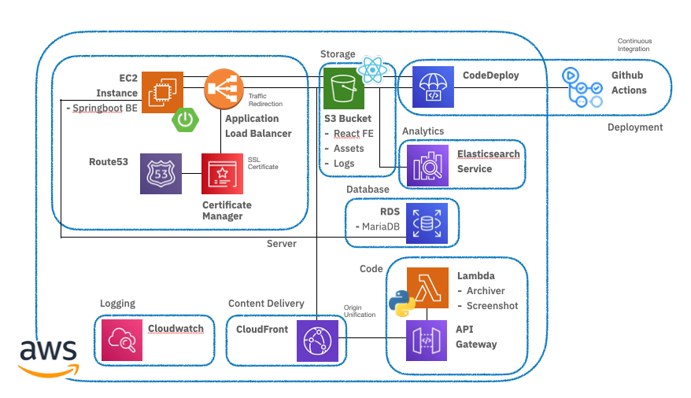

# 사이버보안캡스톤디자인 5조 프로젝트 (2021-1)

사이버수사관의 업무 효율 향상을 위해 반복적인 업무인 사이트 모니터링 업무를 단축시키는 보조 역할의 웹 서비스입니다.

각종 커뮤니티 사이트 게시물을 수집해, 한 페이지에서 모아볼 수 있도록 하며 문제의 소지가 있는 게시물을 아카이빙(Archiving), 자동으로 문서화하는 기능을 제공합니다.

## 주요 기능

- 모니터링

  - 커뮤니티 사이트 비동기 호출, 크롤링 / 파싱

  - 게시물 데이터 저장

- 웹 아카이빙 (스냅샷)

- 웹페이지 스크린샷 (Using selenium)

- PDF 변환 (Using @react-pdf/renderer)

- 시각화 (Using ELK)

## Tech Stack

[Languages] Javascript / Java / Python

[FE] React.js

[BE] Springboot

[Database] MariaDB

[DevOps]

- AWS RDS (Database)

- AWS EC2 (with Elastic L7 Load Balancer (ALB))

- AWS Lambda

- AWS API Gateway

- AWS Cloudfront

- ACM (Amazon Certificate Manager)

- AWS Route53

- Github Actions / AWS CodeDeploy (CI/CD)

- AWS S3 (Static Web Hosting + Assets Storage)

- AWS Elasticsearch Service (ELK Stack - Analytics)

- AWS Cloudwatch (Logging)

- AWS IAM (Identity / Access Management)

### APIs

- Authentication / Monitoring

  - [BE] does (/api)

- Web Archiving / Web screenshot

  - [AWS Lambda / API Gateway] does (/api/[archive|screenshot])

